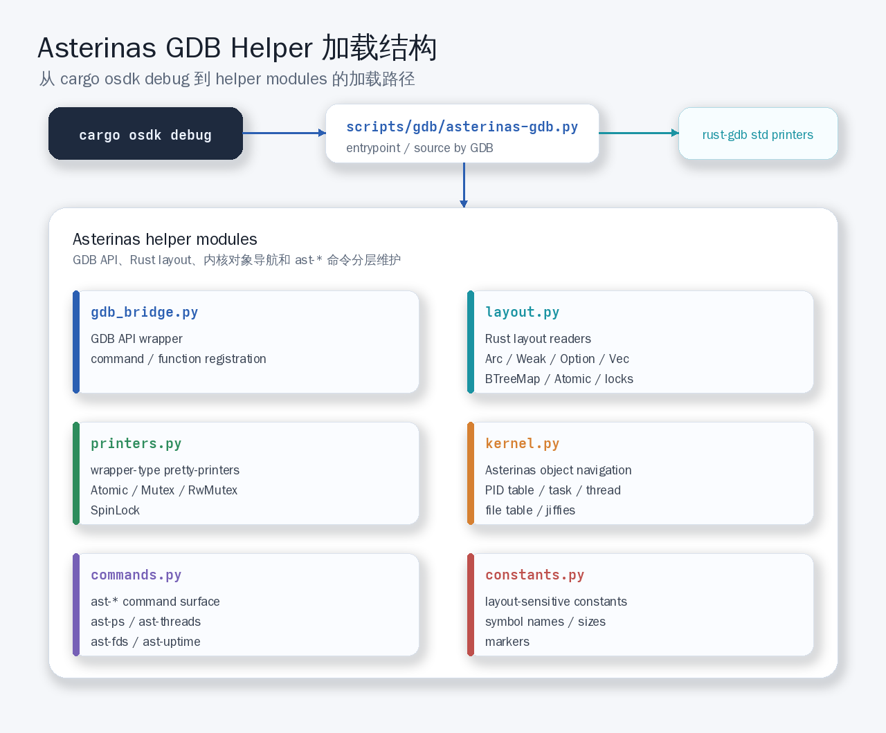
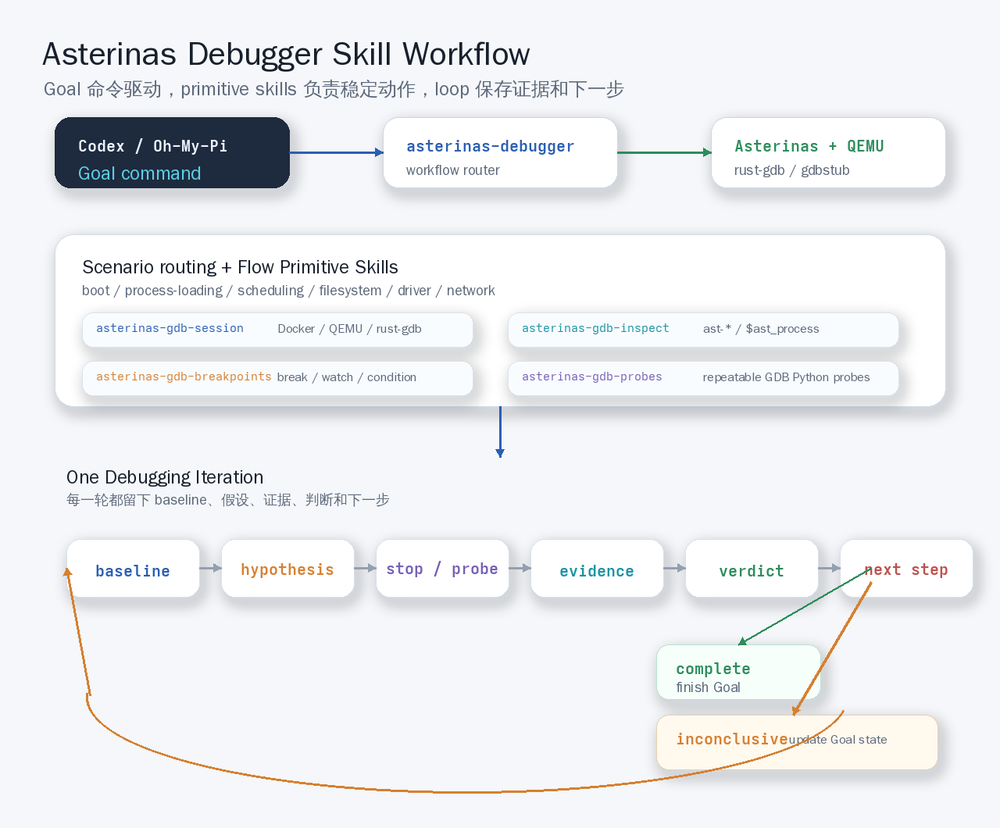
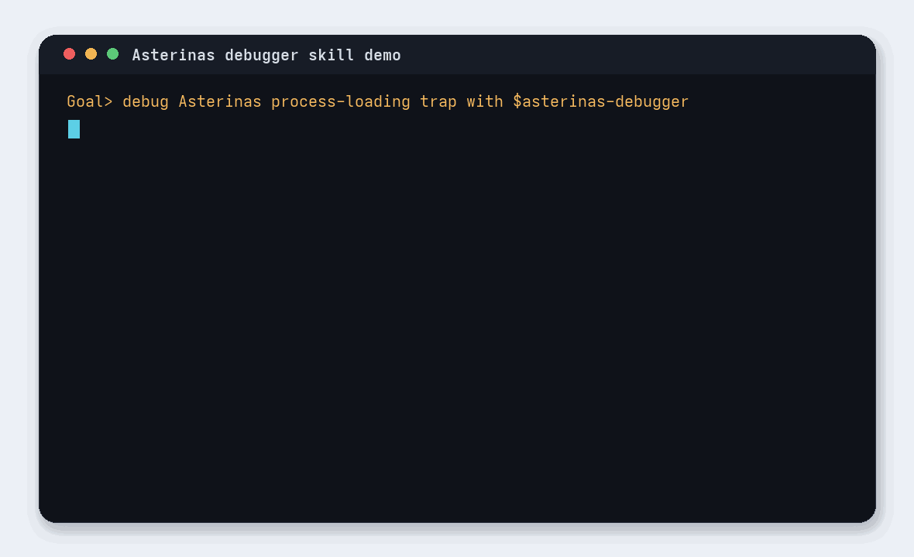

# 从一次断错误开始理解星绽 OS 的 GDB Helper

星绽 OS 的 GDB helper，是我们最近围绕内核调试体验沉淀出来的一层调试辅助能力，起点来自一次实际调试。当时我们在和星绽社区的开发者一起排查一个进程加载阶段的问题。星绽在加载这类用户程序时，会先处理 ELF 里的 `PT_INTERP`，把动态链接器映射进进程地址空间。后续依赖库的解析和装载，会继续由用户态动态链接器推进。

当时我们看的，主要是 Rust 工具链相关的动态依赖。比如 Rust 标准库、核心库这一类库，在构建环境和 OS rootfs 里的版本关系。问题出在版本上：编译阶段链接到的版本，和 OS 内部实际加载到的版本对不上。符号名看起来能匹配，真实地址背后的函数已经偏掉。遇到重名符号时，这个问题会更隐蔽。你以为自己找到了正确的函数，内核实际走到的位置却已经偏离。

后面表现出来的是一次 trap：加载 interpreter 和后续依赖库的过程中，内核触发 trap，用户进程收到 Segmentation Fault。表面上看，这是一个用户态程序断错误，继续往里追，就会穿过动态链接、进程加载、trap handler、内核对象和 Rust 类型系统。

调试路径没有太多花样。我们先用 QEMU 跑星绽 OS，打开 gdbstub，再用 GDB 客户端远程连上去。等进程加载时触发异常以后，从异常现场往前回溯，先找到进程断错误以后陷入内核态的 trap handler，再看 trap handler 里的栈帧和调用栈，最后反推真正引发异常的位置。

这条路理论上可以走通。

真正拖慢我们的，是 Rust 编译以后在 GDB 里的表现。Rust 的命名会把 crate 名、模块路径、类型名、impl 或 trait 上下文、函数名和泛型参数一层层拼起来，泛型单态化以后，具体类型也会继续出现在符号里。反汇编和调用栈里看到的符号名非常长。很多时候你明明知道要看调用链，眼睛还是会被大量重复、冗长、相似的名字拖住。

在 C 或 C++ 程序里做反向分析已经需要耐心。换到 Rust 内核里，噪声会更密集，类型输出也是一个问题。内核里有很多 wrapper 类型，比如 `AtomicBool`、`Mutex<T>`、`RwMutex<T>`、`SpinLock<T>`。GDB 默认会把内部实现也展开出来。如果你只是想看一个布尔值，它会展开成 `AtomicBool -> UnsafeCell<u8> -> value`；如果你只是想看一个锁里的业务对象，它会先把锁本身的内部布局、队列和 `UnsafeCell` 展示出来，然后把真正想看的值藏在很深的位置。

这会持续打断人的思路（可以说是很难受了，多看几眼就昏头的那种）。

最后还是我们写了一些自动化脚本，把调用栈、trace log、debug log 尽可能记录下来，再把日志交给 ChatGPT 做辅助分析。日志结构化以后，问题才逐渐收敛到了具体原因。回过头看，问题其实卡在很多细碎动作上：对象导航、栈回溯、类型解包、日志整理。每一项都不难，放在一起以后，就会不断消耗注意力。所以，这些东西特别适合沉淀成工具，或者说脚手架。

于是就有了后来的 RFC。

## 从 RFC 开始

我们在 Asterinas 社区里提了一个 RFC，讨论是否可以引入一套 GDB helper scripts。最初的参考对象是 Linux kernel 的 `scripts/gdb/`。Linux 内核里有 `lx-ps`、`lx-dmesg` 这类命令，可以在 GDB 里直接看内核状态。星绽当时缺少这一层，早期想法也顺着这个方向展开：给星绽加一层类似的 GDB 调试辅助能力。

最开始的 MVP 版本比较强调 non-invasive，也就是尽量少改内核代码，主要依赖 DWARF debug info、GDB Python API 和 `rust-gdb` 的 pretty-printer 去读取内核状态。这样比较适合快速验证，先把工具跑起来，再拿着具体效果和社区讨论。

后面在 RFC 讨论里，星绽社区 maintainer 田洪亮老师给了影响后续实现的反馈：大家认可这个方向，GDB helper 确实能改善星绽的调试体验。尤其对于习惯 Debugger 的开发者来说，一层面向内核对象的 GDB 命令和 Python 封装，会让调试过程舒服很多。

讨论很快进入了更工程化的问题：长期稳定性怎么保证，投入回报比怎么控制。一开始加很多命令，看起来功能很完整，实际维护成本也会迅速上升。GDB helper 一旦进入上游，它就需要跟着内核结构一起演进。内核数据结构改了，Python 侧如果没有同步，输出可能会悄悄变错。

这个风险需要认真处理。

脚本崩掉反而好处理。更麻烦的是脚本继续运行，输出却错了，最后误导调试。这轮讨论以后，我们的设计思路收了一次：先做高 ROI 的能力，先做最基础、最通用、最能改善所有 GDB 输出的部分，再用 CI 冒烟测试保证这套能力长期可用。

## 先处理 Rust wrapper 类型

第一块高 ROI 的能力，是 pretty-printer。GDB 的默认结构体打印其实可以用，只要 DWARF 信息正常，业务结构体的字段名、层次和递归展示都在。真正制造噪声的是 wrapper 类型：原子类型、锁、智能指针、字符串、`Option`、`Vec`、`BTreeMap`。它们在源码里是常规抽象，到了 GDB 里，默认输出会把内部实现细节全部展开。

这里还有一个取舍：最开始 RFC 里的 MVP，同时考虑了普通 GDB 和 `rust-gdb`。这样看起来兼容面更宽，代码里也会多出很多 fallback 逻辑。每一种 Rust 标准库类型，都要同时处理 `rust-gdb` pretty-printer 能用和不能用两种情况。

社区 review 以后，这块收得更干净了一些：星绽主要在容器环境里开发，容器里的工具链、GDB 版本、Rust 版本都相对稳定。既然已经有 `rust-gdb`，并且它本身已经对 Rust 标准库做了一些显示优化，那 helper 就可以直接站在 `rust-gdb` 的基础上继续往前做。

这样投入回报比会更好：标准库里已经有的展示能力，直接复用；Asterinas 自己更关心的 wrapper 类型，再补一层 printer。代码量少很多，调试时看到的输出也更接近 Rust 开发者习惯的形式。

helper 里优先注册 wrapper-type pretty-printer：`AtomicBool`、`AtomicU32`、`AtomicU64` 这类原子类型，直接折叠成标量值；`ostd::sync::Mutex<T>` 显示成 `Mutex(locked=false)`，并把内部的 `value` 暴露出来。`RwMutex<T>` 和 `SpinLock<T>` 也按类似方式处理。

这个改动会影响所有 GDB 展示路径，`p`、`bt full`、`info locals`、watchpoint 命中时的变量输出，都会直接变清爽。RFC 讨论里也反复提到这一点：不要急着为每个领域对象写 printer。`Process`、`Thread`、`FileTable` 这类业务类型，GDB 默认递归展示就能看。先把 wrapper 噪声压下去，业务类型自然会变得可读。

## 再处理对象导航

第二块能力，是 GDB convenience function。在内核里找一个对象，经常需要走一长串路径。比如 PID 1 对应的 `Process`，你要从全局 `PID_TABLE` 开始，解开 `Mutex<PidTable>`，遍历 `BTreeMap<u32, Arc<PidEntry>>`，再从 `PidEntryInner` 里拿 `Weak<Process>`。中间还会经过 `Arc`、`Weak`、`Option` 这类 Rust 类型。

这类导航适合交给脚本完成，PR 里最后提供了 `$ast_process(pid)`、`$ast_thread(tid)`、`$ast_pid_table()`、`$ast_file_table(pid)` 这类 convenience function。它们返回的是 `gdb.Value`，用户可以继续用 GDB 原生表达式组合。

```gdb
p *$ast_process(1)
p (*$ast_thread(1)).is_exited
p *$ast_file_table(1)
```

这套方式留出了足够空间：脚本负责解决最难的对象定位问题，真正字段怎么展示、想看哪一个字段，继续交给 GDB 表达式和 pretty-printer。将来 `Process` 增加新字段，用户可以直接用 `p (*$ast_process(1)).new_field` 查看，Python 命令不用跟着写一版固定输出。

这块最后形成了一个清晰分工：导航交给 helper，展示交给 GDB，pretty-printer 负责降低噪声。

## 命令只保留聚合能力

第三块能力，才是 `ast-*` 命令。早期原型里有更多命令，其中有些只是对 QEMU monitor 或 GDB 表达式做了一层包装。讨论以后，这部分被收掉了。

命令应该处理单靠 GDB 表达式不方便完成的事情，比如遍历集合、聚合多对象、把结果排成表，或者把进程父子关系整理成树。最后保留下来的命令不多。

`ast-version` 用来看版本。`ast-ps` 用来看进程。`ast-threads` 用来看线程。`ast-pstree` 用来看进程树。`ast-fds <PID>` 用来看文件描述符。`ast-uptime` 用来看内核运行时间。

这组命令覆盖了最常见的内核调试入口：进程是否存在，线程是否正常，文件描述符是否异常，进程树有没有偏，内核已经跑了多久。这些问题在 kernel hang、exec 失败、文件系统问题、进程退出异常里都会反复出现。

## 回到代码实现

PR 里把 helper 放在 `scripts/gdb/` 下面，入口是 `scripts/gdb/asterinas-gdb.py`。这个入口会把 `scripts/gdb/` 加入 Python path，然后尝试注册 `rust-gdb` 的标准库 pretty-printer，接着加载 Asterinas 自己的 `printers`、`kernel` 和 `commands` 模块。

`cargo osdk debug` 也做了配合，优先使用 `rust-gdb`。如果当前 workspace 里存在 `scripts/gdb/asterinas-gdb.py`，就自动 source 这个 helper。这样用户用 OSDK 进入调试时，不需要再手动加载脚本。

模块拆分也比较清晰：`gdb_bridge.py` 负责包一层 GDB Python API，命令注册、函数注册、参数解析、表格输出和错误输出都放在这里；`layout.py` 负责读 Rust 布局，`Arc`、`Weak`、`Option`、`Vec`、`BTreeMap`、`Atomic<T>` 以及 ostd 锁类型，都在这里集中处理。

`printers.py` 负责注册 wrapper-type pretty-printer。`kernel.py` 是最贴近星绽内核结构的一层，知道 PID table 怎么走，`Task`、`Thread`、`PosixThread` 怎么关联，文件表怎么拿，jiffies 怎么读。`commands.py` 面向用户，只做参数解析和输出格式化。真正的内核结构知识，尽量留在 `kernel.py` 和 `layout.py`。

放成结构图看，大概是这样：

```text
cargo osdk debug
    |
    v
scripts/gdb/asterinas-gdb.py
    |-- add scripts/gdb to Python path
    |-- register rust-gdb std printers
    +-- load Asterinas helper modules
        |
        +-- helper/gdb_bridge.py    GDB API wrapper, command/function registration
        +-- helper/layout.py        Rust layout readers: Arc/Weak/Option/Vec/BTreeMap/Atomic/locks
        +-- helper/printers.py      wrapper-type pretty-printers
        +-- helper/kernel.py        Asterinas object navigation: PID table, task/thread, file table, jiffies
        +-- helper/commands.py      ast-* commands, argument parsing, table output
        +-- helper/constants.py     layout-sensitive symbols, names, sizes, markers
```



这个拆分来自 RFC 里的维护性讨论：GDB helper 一定会和内核结构发生耦合。这层耦合最好集中放在少数地方，并且在代码里显式露出来。PR 里把符号名、类型名、线程名长度、timer 频率、文件 vtable marker 这类 layout-sensitive 常量集中放到 `constants.py`。

同时，在 Rust 源码相关位置补了 `COUPLED` 注释，比如 PID table、线程名、文件表、timer jiffies 等结构发生变化时，开发者可以看到对应的 GDB helper 也需要检查。

这个设计看起来不复杂，解决的是实际维护里的问题。GDB helper 上游以后，内核结构还会继续演进，需要让修改内核的人知道，旁边还有一层调试工具依赖当前布局。

## CI 冒烟测试

这类工具最怕慢慢失效：一开始能跑，过几个月内核结构改了，脚本还在仓库里，大家已经不敢用了。

PR 里也加了 GDB smoke test，测试会启动 QEMU，并通过 GDB server 连接 `.osdk-gdb-socket`。GDB source `scripts/gdb/asterinas-gdb.py` 以后，先停在 `__ostd_main`，再前进到 syscall handler 附近。这样可以保证 PID 1 已经出现，进程相关 helper 有对象可读。

后面由 Python 断言检查几类内容：pretty-printer 是否注册成功，关键全局符号是否能解析，`$ast_process(1)`、`$ast_thread(1)`、`$ast_pid_table()`、`$ast_file_table(1)` 是否能返回对象，`ast-ps`、`ast-threads`、`ast-pstree`、`ast-fds 1`、`ast-uptime` 是否能跑出预期输出。

这组测试覆盖不了所有调试场景，至少能确认这套 helper 的基础能力还活着。对上游工具来说，先把这一点守住，后面才有继续扩展的基础。

## 从 GDB Helper 到 Agent Workflow

RFC 提得比较早，大概在 4 月份左右。到 6 月以后，Agent 工具的使用方式变化很快，既然上游已经有了一套星绽 OS 的 GDB helper，我们自然会继续往上想一层。

能不能把这套 helper 接到 Agent 的调试 Workflow 里。

后面就有了 asterinas-debugger 这个小项目。在当前仓库里，它体现为一组 Asterinas Debugger Skills，推荐配合 Codex 或 Oh-My-Pi 使用，尤其适合配合它们的 Goal 命令去跑长程调试任务。

这套 skill 的想法，和 Humanize 里的 Workflow 思路是一致的：先把稳定动作拆成 Flow Primitive，再用 Workflow 把这些 primitive 编排起来。在星绽内核调试里，稳定动作有很多。

这些稳定动作包括准备或复用 Docker 容器，启动 QEMU 并打开 GDB stub，用 `rust-gdb` 连接远程目标，加载 `scripts/gdb/asterinas-gdb.py`，设置断点、硬件断点、条件断点和 watchpoint，打印调用栈、读取寄存器、查看进程和线程，也包括写一个 GDB Python probe，在多个 stop 点采集同一组状态。

这些动作本身都不复杂，放到一次真实内核调试里，就会不断重复。重复多了就会漏，漏了以后，证据链就会断。我们把它们拆成几个 primitive skill。

`asterinas-gdb-session` 负责调试会话，会处理 Docker、QEMU、`rust-gdb`、tmux 和 helper 加载。`asterinas-gdb-inspect` 负责状态观察，会优先使用 `ast-version`、`ast-ps`、`ast-threads`、`ast-fds` 以及 `$ast_process(pid)` 这类 helper。

`asterinas-gdb-breakpoints` 负责把一个假设落成具体断点、条件断点、watchpoint 或 command list。`asterinas-gdb-probes` 负责生成可重复执行的 GDB Python probe。最后由 `asterinas-debugger` 这个 workflow skill 做场景路由，根据问题类型进入不同调试流，比如 boot、process loading、scheduling、filesystem、driver、network/peripheral、framekernel boundary。

不过，只把动作拆成 primitive，再用 Workflow 串起来还不够。调试本身是一个连续迭代过程，一次 stop 只能回答当前假设，回答完以后还要判断是继续追同一条线，还是换一个假设，或者已经可以收敛。这一层更接近 Humanize 里的 RLCR-loop，要让每一轮都留下证据、判断和下一步，让调试从一次性脚本执行，变成连续推进的循环。

简单的实现方式，可以先配合 Codex 或 Oh-My-Pi 的 Goal 命令来做。Goal 负责保存长程目标和当前状态，skill 负责把每一轮调试组织成固定循环：先拿 baseline snapshot，再提出一个具体假设，然后放一个最小有用的断点；停下来以后记录命令、观察结果、raw fallback、判断和下一步。如果判断还没有收敛，就把下一步重新放回 Goal 里，进入下一轮。

这个流程画出来，大概是这样：

```text
Codex / Oh-My-Pi Goal command
    |
    v
asterinas-debugger workflow
    |
    +-- classify scenario
    |      boot / process-loading / scheduling / filesystem / driver / network
    |
    +-- compose primitive skills
    |      asterinas-gdb-session
    |      asterinas-gdb-inspect
    |      asterinas-gdb-breakpoints
    |      asterinas-gdb-probes
    |
    v
one debugging iteration
    baseline snapshot
        -> hypothesis
        -> stop / watchpoint / probe
        -> evidence
        -> verdict
        -> next step
             |
             +-- complete       finish the Goal
             +-- inconclusive   update Goal state and start next iteration
```



如果把这个过程放成一个终端动图，大概就是下面这种形态。Goal 命令先确定长程目标，`asterinas-debugger` 负责选调试场景，再把 session、inspect、breakpoints、probes 这些 primitive skill 按一轮轮调试循环串起来。



如果 helper command 够用，就停在 helper command；需要进一步看字段，就用 convenience function；还不够，再落到 raw GDB expression。重复采样时，再升级成 GDB Python probe。这样调试过程会比较稳。每往下一层，都知道为什么要往下走。

## 回到最初那个问题

现在再看最开始那次动态库版本不一致的问题，这套工具链能帮上的地方就比较明确了。当时我们花了一天一夜，时间大量消耗在重复动作上：找 trap handler，翻调用栈，清理 Rust 符号噪声，打印内核对象，整理 trace log，再从日志里找规律。

如果当时已经有这套 GDB helper，第一步就可以先拿到更清晰的进程、线程、文件描述符和内核对象状态。如果再配合 Agent workflow 和 Goal-driven loop，调试过程可以继续被压缩：Agent 先建立 baseline，然后围绕进程加载、动态库映射、文件打开、trap 现场逐步放断点。遇到需要重复采集的状态，就生成 probe；每次 stop 之后，Goal 里继续保存当前假设、证据、判断和下一轮动作。

这样作为开发者，就可以把注意力放在真正的异常链路上：动态库到底加载了哪个版本，符号解析在哪一步发生偏移，trap 前最后一次用户态到内核态的边界在哪里，哪些对象状态和预期不一致。这些问题我觉得才是关键。


撰文：泽文(Zevorn)

资料来源：

[1] RFC: Add GDB helper scripts for non-invasive kernel debugging  
https://github.com/asterinas/asterinas/issues/3094

[2] PR: Add GDB helpers for kernel debugging  
https://github.com/asterinas/asterinas/pull/3412

[3] Asterinas Debugger Skills  
https://github.com/zevorn/asterinas-debugger
